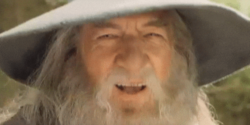

# The Journey Continues...
My Student it is up to you to continue the prophecy. I am passing down the torch to you.

 

The SSS data processing is complete, and some initial work has been started on the SSS SLAM frontend through lightweight experiments with data association, loop closure detection, and landmark descriptor based pruning. These experiments investigated whether landmark descriptors could be used for early pruning in order to bound the runtime cost of the full data association problem. The preliminary results were promising, but the implementation was experimental and not mature enough to be included in this work.

 

The general continuation of this work is, however, relatively straightforward. Landmark measurements from the SSS SLAM data-processing pipeline can be compared against previously observed landmarks stored in a landmark database. A descriptor based nearest neighbour search, for example using FLANN, can first be used to produce a limited set of candidate matches. Obvious outliers can then be rejected, while the remaining candidates are passed to a stricter global gating and data association stage using methods such as Fast JCBB. If valid matches are found, loop closures can be created and the corresponding landmark entries in the database can be updated. If no viable matches are found, the current landmarks can instead be treated as new observations and added to the database for future matching.

 

These landmark observations and loop closures can then be converted into factors and inserted into a graph based optimizer. A landmark based incremental optimizer such as iSAM2 is recommended, since it is widely used and well suited for this type of SLAM problem. For implementation, GTSAM is a strong choice, as it is a well established factor graph framework commonly used in complex SLAM systems. In addition, GTSAM supports IMU pre-integration, which should be used to avoid overwhelming the SLAM backend with high rate state estimation factors. Instead, standard pre-integration library in GTSAM can be used to efficiently combine IMU data, aiding measurements and sonar map frames into a compact graph representation.

 

Passing these factors to the optimizer then provides an optimal real-time estimate of the drone state. This estimate can be used to build the global map image, fed back into the SSS SLAM data-processing pipeline, and further used for mission planning and collision avoidance.

 

And that is about it. You got this. I believe in you. The path is not easy, the code will be glorious, and the optimizer may occasionally explode for reasons known only to the old gods of linear algebra. But continue forward, brave student, for the pipeline is yours now.

 

"All we have to decide is what to do with the time that is given us"

\- Gandalf, Lord of the Rings

